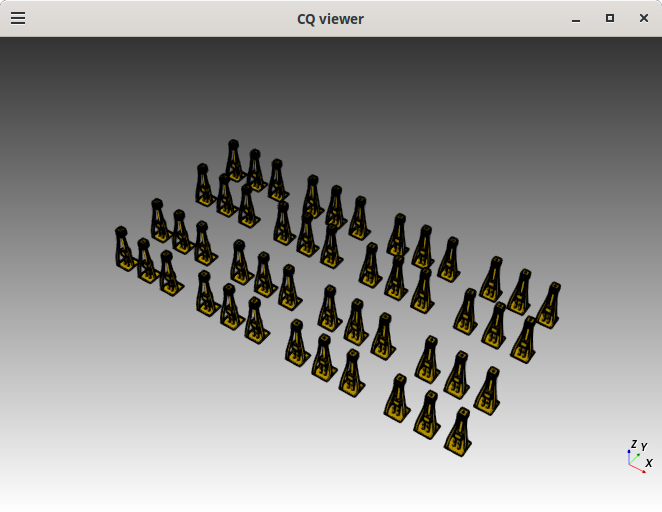

# R_E_R_F generator for prototype braille dot bobbins using CadQuery

This app generates a set of prototype braille dot bobbins with the intention
of creating a solenoid by wrapping wire around the bobbin and then having
a iron/steel shaft with a braille dot on the end that will be controlled
by the solenoid. These dots would then be assembled into a 2 x 8 braille
dot or possibly an large braille "tablet" that could display graphical
information as well as braille text.

The bobbins are designed to be printed on a resin 3D printer which supports
"Resin Exposure Range Finder" as implemented by some AnyCubic resin 3D
printers. On the Anycubic printers I'm familiar with this is done by having
the basename of the file being "R_E_R_F" followed by the extension which
is device specific. For the "Photon Mono 4' the extension is `.pm4n` and
for the "Photon Mono 4 ultra" `.pm4u` as created by the
AnycubicPhotonWorkshop slicer software.

The app operates in two modes controlled by `--rerf` and `--no-rerf` with
the default being `--no-rerf`. In the `--rerf` mode the printer bed is
divided into 8 grid areas, each of which contains a set of bobbins
that are arranged in a row and column pattern. And the exposure time in
each area increases by 250ms, at least in the AnyCubic Photon Mono 4 printer.

A rerf_number is printed on the positive Y face, ">Y", of the upper cube
and each bobbin in that area has the same rerf_number. Thus this
identifies the exposure time for that bobbin. Also, each bobbin is
also engraved with the `row_count` and `col_count` parameters on the
negative Y face, "\<Y", of the upper cube. This allows you to identify
which position within the grid area the bobbin is located further
allowing the user to identify possible exposure descrpencies within
an area and the print bed as a whole.

On the positive X face, ">X", of the upper cube is the `--cube_size`
parameter which is the size of the cube in millimeters. And
on the negative X face, "\<X", of the upper cube is the `--tube_hole_diameter`,
which is the diameter of the tube hole in millimeters.

You must supply 4 parameters to the app:
- `filename`: The name of the output file (without extension).
- `format`: The format to export the model, either `stl` or `step`.
- `row_count`: The number of rows to create (must be >= 1).
- `col_count`: The number of columns to create (must be >= 1).


## Requirements

- Python 3.12
- Micromamba or Mamba, Conda ..

## Setup

### Install Micromamba

On 3900x I'm currently using micromamba, which is a static linked version of mamba/conda
and is smaller.

Installed via aur: https://aur.archlinux.org/packages/micromamba-bin

```
git clone https://aur.archlinux.org/micromamba-bin.git
cd micromamba-bin/
makepkg -sir
```

Verify micromamba is installed:

```
micromamba --version
```

Clone this repository and then `cd rerf-bd-bobbin-cq/` create the environment:

```
wink@3900x 25-05-23T17:13:48.108Z:~/data/prgs/3dprinting/rerf-bd-bobbin-cq
$ micromamba create -f environment.yml 
warning  libmamba 'repo.anaconda.com', a commercial channel hosted by Anaconda.com, is used.
    
warning  libmamba Please make sure you understand Anaconda Terms of Services.
    
warning  libmamba See: https://legal.anaconda.com/policies/en/
pkgs/main/noarch                                   748.1kB @   1.4MB/s  0.0s
pkgs/r/linux-64                                      1.6MB @  16.2MB/s  0.1s
pkgs/r/noarch                                        2.0MB @  38.8MB/s  0.1s
pkgs/main/linux-64                                   7.6MB @  16.3MB/s  0.4s
conda-forge/noarch                                  20.5MB @  29.1MB/s  0.6s
conda-forge/linux-64                                44.1MB @  52.0MB/s  0.8s


Transaction

  Prefix: /home/wink/.local/share/mamba/envs/rerf-bd-bobbins-cq

  Updating specs:

   - python=3.12
   - cadquery


  Package                                            Version  Build                  Channel          Size
────────────────────────────────────────────────────────────────────────────────────────────────────────────
  Install:
────────────────────────────────────────────────────────────────────────────────────────────────────────────

  + _libgcc_mutex                                        0.1  conda_forge            conda-forge       3kB
  + _openmp_mutex                                        4.5  2_gnu                  conda-forge      24kB
  + _x86_64-microarch-level                                3  2_x86_64_v3            conda-forge       8kB

  ..

  + yarl                                              1.20.0  py312h178313f_0        conda-forge     156kB
  + zlib                                               1.3.1  hb9d3cd8_2             conda-forge      92kB
  + zstd                                               1.5.7  hb8e6e7a_2             conda-forge     568kB

  Summary:

  Install: 270 packages

  Total download: 454MB

────────────────────────────────────────────────────────────────────────────────────────────────────────────


Confirm changes: [Y/n] 

Transaction starting
ocp                                                 34.0MB @  29.0MB/s  1.1s
python                                              32.3MB @  20.3MB/s  1.5s
vtk-base                                            41.9MB @  22.7MB/s  1.7s

..

fonts-conda-forge                                    4.1kB @  ??.?MB/s  0.0s
_libgcc_mutex                                        2.6kB @  ??.?MB/s  0.0s
fonts-conda-ecosystem                                3.7kB @  ??.?MB/s  0.1s
Linking python_abi-3.12-7_cp312
Linking _x86_64-microarch-level-3-2_x86_64_v3

..

Linking occt-7.7.2-all_h4c9f3c6_201
Linking ocp-7.7.2.1-py312h4aa6242_0
Linking cadquery-2.5.2-pyhd8ed1ab_1

Transaction finished


To activate this environment, use:

    micromamba activate rerf-bd-bobbins-cq

Or to execute a single command in this environment, use:

    micromamba run -n rerf-bd-bobbins-cq mycommand

wink@3900x 25-05-23T17:15:14.843Z:~/data/prgs/3dprinting/rerf-bd-bobbins-cq (wip-add-generate_upper_cube_supports)
```

Activate rerf-bd-bobbins-cq environment:

```
wink@3900x 25-05-23T17:15:14.843Z:~/data/prgs/3dprinting/rerf-bd-bobbins-cq (wip-add-generate_upper_cube_supports)
$ micromamba activate rerf-bd-bobbins-cq
(rerf-bd-bobbins-cq) wink@3900x 25-05-23T17:15:27.711Z:~/data/prgs/3dprinting/rerf-bd-bobbins-cq (wip-add-generate_upper_cube_supports)
```

Verify rerf-bd-bobbins.py runs
```
$ ./rerf-bd-bobbins.py -v
rerf-bd-bobbins.py v1.1.0
```

### Other Options

- **Miniconda (Recommended):** [https://docs.conda.io/en/latest/miniconda.html](https://docs.conda.io/en/latest/miniconda.html)
- **Anaconda:** [https://www.anaconda.com/products/distribution](https://www.anaconda.com/products/distribution)

## Usage

### Activating the Environment

Activate the environment using:

```sh
micromamba activate rerf-bd-bobbins-cq
```

### Help

To see the help message for the script, run:
```
$ ./rerf-bd-bobbins.py -h
usage: rerf-bd-bobbins.py [-h] [-v] [-cs CUBE_SIZE] [-tl TUBE_LENGTH] [-thd TUBE_HOLE_DIAMETER] [-twt TUBE_WALL_THICKNESS] [--bed_resolution BED_RESOLUTION] [--bed_size BED_SIZE] [-lh LAYER_HEIGHT] [-bs BASE_SIZE]
                          [-bh BASE_HEIGHT] [-ea EDGE_ADJUSTMENT] [-zl ZLIFT_HEIGHT] [-ol OVERLAP] [-pbsp width height] [-pbl x y] [-re | --rerf | --no-rerf] [-s | --show | --no-show]
                          filename {stl,step} row_count col_count

rerf-bd-bobbins-cq v1.1.0 Generate Braille Dispaly Bobbins with text inscriptions.

positional arguments:
  filename              Name of the output file (without extension)
  {stl,step}            Format to export the model ('stl' or 'step')
  row_count             Number of rows to create (>= 1)
  col_count             Number of columns to create (>= 1)

options:
  -h, --help            show this help message and exit
  -v, --version         show program's version number and exit
  -cs CUBE_SIZE, --cube_size CUBE_SIZE
                        Cube size engraved on the +X face, defaults to 2.397
  -tl TUBE_LENGTH, --tube_length TUBE_LENGTH
                        Tube length defaults to 7.200
  -thd TUBE_HOLE_DIAMETER, --tube_hole_diameter TUBE_HOLE_DIAMETER
                        Tube hole diameter engraved on the -X face, defaults to 0.714
  -twt TUBE_WALL_THICKNESS, --tube_wall_thickness TUBE_WALL_THICKNESS
                        Tube wall thickness, defaults to 0.204
  --bed_resolution BED_RESOLUTION
                        resolution of the printer bed, defaults to 0.017
  --bed_size BED_SIZE   size of the bed, defaults to (153.408, 87.040)
  -lh LAYER_HEIGHT, --layer_height LAYER_HEIGHT
                        Layer height for this print, defaults to 0.050
  -bs BASE_SIZE, --base_size BASE_SIZE
                        Size of the square base in mm, defaults to 5.98
  -bh BASE_HEIGHT, --base_height BASE_HEIGHT
                        Base height in mm, defaults to 0.500
  -ea EDGE_ADJUSTMENT, --edge_adjustment EDGE_ADJUSTMENT
                        size of the bed, defaults to (1.300
  -zl ZLIFT_HEIGHT, --zlift_height ZLIFT_HEIGHT
                        Height from bed to bottom of the solenoid base, defaults to 5.000
  -ol OVERLAP, --overlap OVERLAP
                        Overlap between two objects, defaults to 0.100
  -pbsp width height, --position_box_size width height
                        Size of box to disperse the solenoids into, defaults to (85.0, 42.5)
  -pbl x y, --position_box_location x y
                        Location of position_box, defaults to (0, 0)
  -re, --rerf, --no-rerf
                        If true generate 8 objects in R_E_R_F orientation, defaults to False
  -s, --show, --no-show
                        Show the created object in the viewer

Version: 1.1.0
```


### Running the App

Ensure the environment is activated, see [Activating the Environment](#activating-the-environment). Then run the script directly with:

```sh
./rerf-bd-bobbins.py <filename> <format> <row_count> <col_count> [options]
```

Example:

Create one bobbin using the defaults and show it in the viewer:
```sh
$ ./rerf-bd-bobbins.py bd stl 1 1 -s
Generating one set of objects with no rerf_number
position_box_width: 85.000, position_box_height: 42.500, cube_size_half: 1.190
x_initial: 1.190, y_initial: 1.190, x_step: 82.603, y_step: 40.103
Exporting model to bd_cz-2.397_tl-7.200_thd-0.714_twt-0.204_rc-1_cc-1_lh-0.050_box-85.000x42.500.stl
Showing model..
```


Here we make R_E_R_F file with 8 sets of 2 rows and 3 columns of bobbins, each with a different exposure time:

```sh
$ ./rerf-bd-bobbins.py bd stl 2 3 -s  --rerf
Generating 8 sets of R_E_R_F bd bobbins with rerf_numbers 1 .. 8
sequential_order: 0 rerf_number: 8
position_box_width: 34.510, position_box_height: 39.168, cube_size_half: 1.190
x_initial: 1.190, y_initial: 1.190, x_step: 10.710, y_step: 18.394
position_box_location_x: 38.352, position_box_location_y: 10.880
sequential_order: 1 rerf_number: 7
position_box_width: 34.510, position_box_height: 39.168, cube_size_half: 1.190
x_initial: 1.190, y_initial: 1.190, x_step: 10.710, y_step: 18.394
position_box_location_x: 38.352, position_box_location_y: 54.400
sequential_order: 2 rerf_number: 6
position_box_width: 34.510, position_box_height: 39.168, cube_size_half: 1.190
x_initial: 1.190, y_initial: 1.190, x_step: 10.710, y_step: 18.394
position_box_location_x: 76.704, position_box_location_y: 10.880
sequential_order: 3 rerf_number: 5
position_box_width: 34.510, position_box_height: 39.168, cube_size_half: 1.190
x_initial: 1.190, y_initial: 1.190, x_step: 10.710, y_step: 18.394
position_box_location_x: 76.704, position_box_location_y: 54.400
sequential_order: 4 rerf_number: 4
position_box_width: 34.510, position_box_height: 39.168, cube_size_half: 1.190
x_initial: 1.190, y_initial: 1.190, x_step: 10.710, y_step: 18.394
position_box_location_x: 115.056, position_box_location_y: 10.880
sequential_order: 5 rerf_number: 3
position_box_width: 34.510, position_box_height: 39.168, cube_size_half: 1.190
x_initial: 1.190, y_initial: 1.190, x_step: 10.710, y_step: 18.394
position_box_location_x: 115.056, position_box_location_y: 54.400
sequential_order: 6 rerf_number: 2
position_box_width: 34.510, position_box_height: 39.168, cube_size_half: 1.190
x_initial: 1.190, y_initial: 1.190, x_step: 10.710, y_step: 18.394
position_box_location_x: 153.408, position_box_location_y: 10.880
sequential_order: 7 rerf_number: 1
position_box_width: 34.510, position_box_height: 39.168, cube_size_half: 1.190
x_initial: 1.190, y_initial: 1.190, x_step: 10.710, y_step: 18.394
position_box_location_x: 153.408, position_box_location_y: 54.400
Exporting model to bd_rerf_rc-2_cc-3_lh-0.050.stl
Showing model..
```


## Exported Files

The generated files will be saved in the current directory with the specified format.

## Notes

- Ensure you are in the `cq` environment before running the script (`make activate`).
- Tested on Linux, Windows, and Mac.

## License

Licensed under either of

- Apache License, Version 2.0 ([LICENSE-APACHE](LICENSE-APACHE) or [http://apache.org/licenses/LICENSE-2.0](http://apache.org/licenses/LICENSE-2.0))
- MIT license ([LICENSE-MIT](LICENSE-MIT) or [http://opensource.org/licenses/MIT](http://opensource.org/licenses/MIT))

### Contribution

Unless you explicitly state otherwise, any contribution intentionally submitted
for inclusion in the work by you, as defined in the Apache-2.0 license, shall
be dual licensed as above, without any additional terms or conditions.
